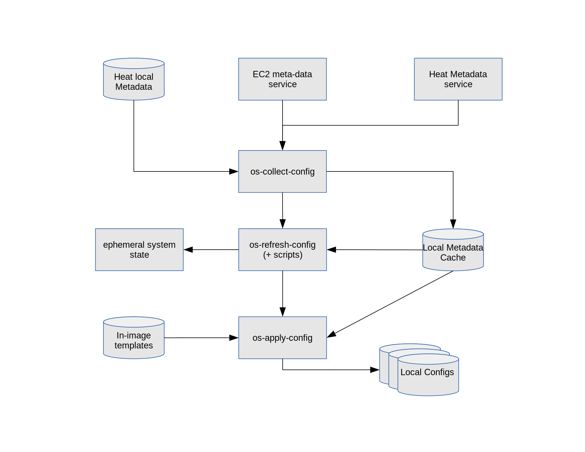

=================
os-collect-config
=================

-------------------------------------------------
Collect configuration from cloud metadata sources
-------------------------------------------------

What does it do?
================

It collects data from defined configuration sources and runs a defined
hook whenever the metadata has been changed.

[#update_svg]_

Usage
=====

You must define what sources to collect configuration data from in
*/etc/os-collect-config.conf*.

The format of this file is::

  [default]
  command=os-refresh-config

  [cfn]
  metadata_url=http://192.0.2.99:8000/v1/
  access_key_id = ABCDEFGHIJLMNOP01234567890
  secret_access_key = 01234567890ABCDEFGHIJKLMNOP
  path = MyResource
  stack_name = my.stack

These sources will be polled and whenever any of them is changed,
*default.command* will be run. A file will be written to the cache
dir, os_config_files.json, which will be a json list of the file paths
to the current copy of each metadata source. This list will also be
set as a colon separated list in the environment variable
*OS_CONFIG_FILES* for the command that is run. So in the example
above, *os-refresh-config* would be executed with something like this
in *OS_CONFIG_FILES*::

  /var/lib/os-collect-config/ec2.json:/var/lib/os-collect-config/cfn.json

The previous version of the metadata from a source (if available) is present at $FILENAME.last.

When run without a command, the metadata sources are printed as a json document.

Quick Start
===========

Install::

  sudo pip install -U git+git://git.openstack.org/openstack/os-collect-config.git

Run it on an OpenStack instance with access to ec2 metadata::

  os-collect-config

That should print out a json representation of the entire ec2 metadata tree.

.. [#update_svg] Recommend using LibreOffice draw to edit os-collect-config-and-friends.odg and regenerate the svg file. Alternatively edit the svg directly, but remove the .odg file if that is done.
